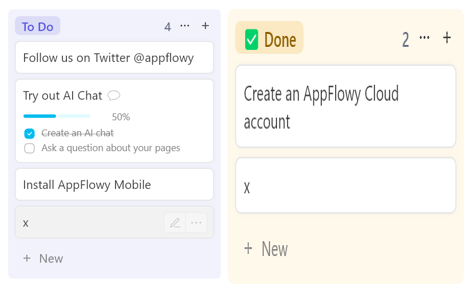
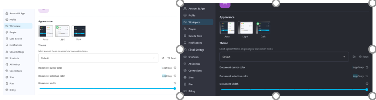
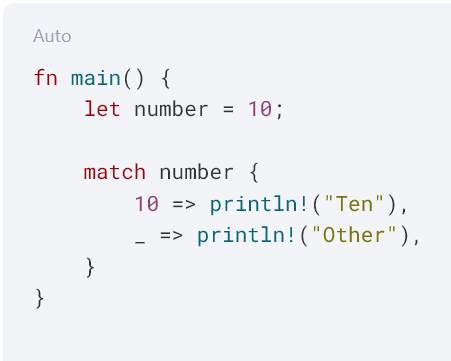
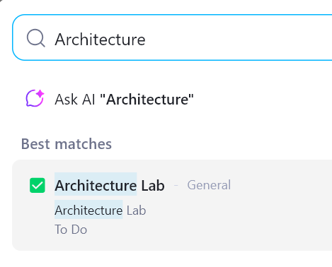
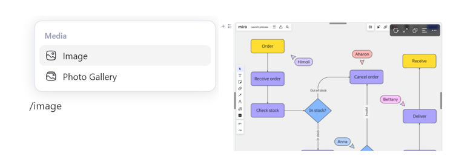

# AppFlowy Функциональ Шаардлагууд (15 FR) - SRS v1.0

### FR-01: Локал өөрчлөлтийг автоматаар хадгалах (Auto-Save Local Changes)

- **Тодорхойлолт:** Систем нь хэрэглэгч ямар нэгэн үйлдэл хийхгүй 300ммс болох үед ажлын орчны баримт бичгийн бүх өөрчлөлтийг локал SQLite өгөгдлийн санд **шууд хадгална**.
- **Зэрэглэл:** `must`
- **Шалгах дараалал:**
  1. AppFlowy дээр шинэ хоосон баримт нээнэ.
  2. 500 тэмдэгт бүхий туршилтын текст оруулна.
  3. Ямар нэгэн товчлуур дарахгүйгээр 500ммс хүлээнэ.
  4. Task Manager ашиглан програмыг хүчээр хаана (Force close).
  5. Програмыг дахин нээж, 500 тэмдэгт бүрэн хадгалагдсан эсэхийг шалгана.
- **Баталгаажуулах нөхцөл:** Програм хаагдахад нэг ч тэмдэгт гээгдэхгүй.

### FR-02: Баримтын шаталсан бүтэц ба навигаци (Document Page Tree Navigation)

- **Тодорхойлолт:** Систем нь зүүн талын цэсэнд баримтуудын шаталсан (tree) бүтцийг харуулах бөгөөд хуудаснуудыг чирж байрлалыг солих (drag-and-drop) боломжтой байна.
- **Зэрэглэл:** `must`
- **Шалгах дараалал:**
  1. Parent хуудас А болон Child хуудас Б-г үүсгэнэ.
  2. Хуудас Б-г зүүн цэсэнд хуудас А-ийн доор чирж оруулна.
  3. Дэд бүтцийн харагдац болон хураах/дэлгэх (collapse/expand) товчийг шалгана.
- **Баталгаажуулах нөхцөл:** Хуудасны бүтэц нүдэн дээр шинэчлэгдэж, parent-child хамаарал өгөгдлийн санд хадгалагдана.

### FR-03: Rich-Text Block Editor

- **Тодорхойлолт:** Систем нь блокт суурилсан текст засварлагчийг дэмжих бөгөөд Slash (`/`) коммандаар текстийг Гарчиг (H1-H3), Жагсаалт, Код блок, Ишлэл болгон хувиргах боломжтой байна.
- **Зэрэглэл:** `must`
- **Шалгах дараалал:**
  1. Шинэ блок дээр `/h1` гэж бичээд Enter дарна.
  2. Текстийн хэлбэр Heading 1 болон өөрчлөгдсөнийг шалгана.
- **Баталгаажуулах нөхцөл:** Slash коммандын 8 үндсэн блок хэлбэр баримтын бүтцийг алдагдуулахгүйгээр хөрвөнө.

### FR-04: Канбан самбарын багана удирдлага (Kanban Board Column Management)

- **Тодорхойлолт:** Систем нь хэрэглэгчид Канбан самбар дотор шинэ багана үүсгэх, нэрийг өөрчлөх, байрлалыг солих болон устгах боломжийг олгоно.
- **Зэрэглэл:** `must`
- **Шалгах дараалал:**
  1. Шинэ нэртэй шинэ багана нэмнэ.
  2. Заасан баганыг "Хийх" болон "Хийсэн" багануудын хооронд чирж байрлуулна.
  3. Баганыг устгаж, сануулах цонхыг баталгаажуулна.
- **Баталгаажуулах нөхцөл:** Баганын дараалал өгөгдлийн сан болон интерфэйс дээр цаг тухайд нь шинэчлэгдэнэ.

### FR-05: Карт чирэх ба төлөв өөрчлөх (Card Drag-and-Drop Reassignment)

- **Тодорхойлолт:** Систем нь хэрэглэгч даалгаврын картыг өөр Канбан багана руу чирж оруулмагц тухайн картны төлөв (status) атрибутыг **шууд шинэчилнэ**.
- **Зэрэглэл:** `must`
- **Mock UI Screenshot:** 
- **Шалгах дараалал:**
  1. "To-Do" баганад Карт Х үүсгэнэ.
  2. Карт Х-г "Done" багана руу чирж оруулна.
  3. Карт Х-ийн шинж чанарыг нээж, төлөвийн шошгыг шалгана.
- **Баталгаажуулах нөхцөл:** Картны төлөв автомат тохиргоогоор "Done" болж өөрчлөгдөнө.

### FR-06: Grid View Filtering

- **Тодорхойлолт:** Систем нь тодорхой баганын атрибутад хэрэглэгчийн тохируулсан логик дүрмүүдийг (Тэнцүү, Агуулсан, Хоосон) ашиглан хүснэгтийн мөрүүдийг шүүнэ.
- **Зэрэглэл:** `should`
- **Шалгах дараалал:**
  1. Өөр өөр чухал түвшний (Өндөр, Дунд, Бага) шошготой 5 мөр үүсгэнэ.
  2. Шүүлтүүр ашиглана: `Чухал түвшин Тэнцүү Өндөр`.
- **Баталгаажуулах нөхцөл:** Зөвхөн "Өндөр" шошготой мөрүүд харагдаж үлдэнэ.

### FR-07: Markdown форматаар экспортлох (Raw Markdown Export)

- **Тодорхойлолт:** Систем нь сонгосон хуудсыг гарчиг болон жагсаалтын синтаксийг агуулсан стандарт UTF-8 кодолгоотой `.md` файл болгон экспортлох **ёстой**.
- **Зэрэглэл:** `must`
- **Шалгах дараалал:**
  1. H1, H2 ба жагсаалт бүхий хуудас үүсгэнэ.
  2. Export -> Markdown сонголтыг дарна.
  3. Үүссэн файлыг энгийн текст editor нээнэ.
- **Баталгаажуулах нөхцөл:** Экспортлогдсон файл стандарт Markdown форматыг (`#`, `##`, `*`) бүрэн агуулсан байна.

### FR-08: Dark and Light Theme Toggle

- **Тодорхойлолт:** Систем нь програмыг дахин эхлүүлэх шаардлагагүйгээр UI өнгөний сонголтыг Light, Dark болгон Системийн горим хооронд шууд өөрчилнө.
- **Зэрэглэл:** `should`
- **Mock UI Screenshot:** 
- **Шалгах дараалал:**
  1. Settings -> Appearance хэсэг рүү орно.
  2. Dark mode сонгоно.
- **Баталгаажуулах нөхцөл:** Фон болон текстийн өнгөнүүд дэлгэц анивчихгүйгээр шууд солигдоно.

### FR-09: Локал орчны нөөц хуулбар хийх (Local Workspace Backup Creation)

- **Тодорхойлолт:** Систем нь хэрэглэгчийн хүсэлтээр SQLite өгөгдлийн сан болон медиа файлуудыг агуулсан `.zip` архив файл үүсгэнэ.
- **Зэрэглэл:** `must`
- **Шалгах дараалал:**
  1. Settings -> Storage -> Export Backup сонголтыг сонгоно.
  2. Фолдероо сонгоод процессыг эхлүүлнэ.
  3. Үүссэн архивыг задалж, файлуудыг шалгана.
- **Баталгаажуулах нөхцөл:** Архив дотор хүчинтэй `appflowy.db` файл болон зургийн фолдер байна.

### FR-10: Кодны синтакс тодруулагч (Inline Code Syntax Highlighting)

- **Тодорхойлолт:** Систем нь Rust, Dart, Python, болон C++ зэрэг хэлнүүдийн код блокод зориулсан синтакс өнгө тодруулалтыг ажиллуулна.
- **Зэрэглэл:** `should`
- **Mock UI Screenshot:** 
- **Шалгах дараалал:**
  1. Код блок оруулж, хэлийг "Rust" гэж сонгоно.
  2. Rust кодын түлхүүр үгс агуулсан (`fn`, `let`, `match`) snippet буулгана.
- **Баталгаажуулах нөхцөл:** Түлхүүр үгс болон текстийн утгууд тус тусын өнгөөр тодорно.

### FR-11: Өгөгдлийн сангийн хүснэгт эрэмбэлэх (Database Table Sorting)

- **Тодорхойлолт:** Систем нь хүснэгтийн мөрүүдийг текст, огноо эсвэл тоон атрибутаар нь өсөх болон буурах дарааллаар эрэмбэлнэ.
- **Зэрэглэл:** `should`
- **Шалгах дараалал:**
  1. 15, 3, 42 гэсэн тоон утгатай 3 мөр үүсгэнэ.
  2. Click Sort -> Number Column -> Ascending. гэж сонгоно.
- **Баталгаажуулах нөхцөл:** Харагдах дараалал шууд 3, 15, 42 болж шинэчлэгдэнэ.

### FR-12: Хогийн савнаас баримт сэргээх (Trash Bin Document Recovery)

- **Тодорхойлолт:** Систем нь устгагдсан хуудсуудыг түр Хогийн сав руу шилжүүлэх бөгөөд 30 хоногийн дотор анхны байрлалд нь бүрэн сэргээх боломжийг олгоно.
- **Зэрэглэл:** `must`
- **Шалгах дараалал:**
  1. Хуудас Ү-г устгана.
  2. Хогийн сав руу орж Хуудас Ү-г олно.
  3. "Сэргээх" товчийг дарна.
- **Баталгаажуулах нөхцөл:** Хуудас Ү анхны агуулгаараа зүүн цэсэнд дахин гарч ирнэ.

### FR-13: Ажлын орчны нэгдсэн хайлт (Workspace Search / Global Find)

- **Тодорхойлолт:** Систем нь Ctrl+P товчоор хайлт хийхэд хайсан текст агуулсан баримтуудын жагсаалтыг 200ммс-ийн дотор буцаана.
- **Зэрэглэл:** `must`
- **Mock UI Screenshot:** 
- **Шалгах дараалал:**
  1. Ctrl+P дарахад хайлтын цонх гарна.
  2. "Архитектур" гэсэн үг хайна.
- **Баталгаажуулах нөхцөл:** "Архитектур" гэсэн үг орсон бүх хуудасны дарж болох жагсаалт гарч ирнэ.

### FR-14: Зураг оруулах ба хадгалах (Inline Image Attachment Upload)

- **Тодорхойлолт:** Систем нь хэрэглэгчид локал зургийн файлуудыг (PNG, JPG, WebP) оруулж, локал медиа directory дотор хадгалах боломжийг олгоно.
- **Зэрэглэл:** `should`
- **Mock UI Screenshot:** 
- **Шалгах дараалал:**
  1. `/image` гэж бичээд `diagram.png` файлыг хуулж оруулна.
- **Баталгаажуулах нөхцөл:** Зураг editor дотор харагдаж, локал медиа directory руу хуулагдана.

### FR-15: Custom Property Tag Creation

- **Тодорхойлолт:** Систем нь өгөгдлийн сангийн мөр болон картуудад зориулж олон сонголттой өнгөт шошго үүсгэх боломжийг олгоно.
- **Зэрэглэл:** `could`
- **Шалгах дараалал:**
  1. Картны шинж чанар засварлагчийг нээнэ.
  2. Улаан өнгөтэй "Яаралтай" нэртэй шинэ шошго үүсгэнэ.
- **Баталгаажуулах нөхцөл:** "Яаралтай" шошго хадгалагдаж, тухайн харагдац доторх бүх карт дээр сонгох боломжтой болно.
