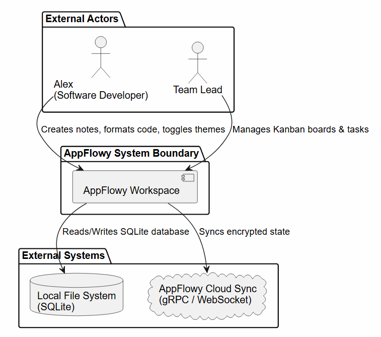
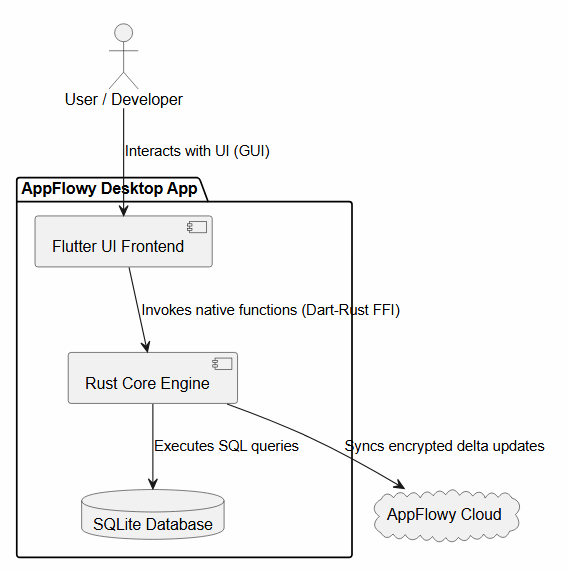

# C4 Model Architecture Diagrams - AppFlowy

Энэхүү баримт бичигт AppFlowy системийн C4 загварын Context (Түвшин 1) болон Container (Түвшин 2) диаграммуудыг баримтжуулсан болно.

---

## 1. C4 Level 1: System Context Diagram

AppFlowy систем болон түүний гадаад орчин, хэрэглэгчид, хөрш системүүдийн харилцан үйлчлэлийг харуулна.

### Диаграммын тайлбар:
* **Alex & Team Lead:** Системийг ашиглаж буй үндсэн хэрэглэгчид.
* **AppFlowy Workspace:** Бидний хөгжүүлж буй үндсэн систем.
* **Local File System:** Офлайн орчинд SQLite өгөгдлийн бааз хадгалах гадаад орчин.
* **AppFlowy Cloud Sync:** Олон төхөөрөмжийн хооронд өгөгдөл ижилсүүлэх remote сервер.

---

## 2. C4 Level 2: Container Diagram

AppFlowy аппликейшний дотоод бүтэц (Flutter UI, Rust Core Engine, SQLite Storage) болон тэдгээрийн хоорондын харилцан үйлчлэлийг харуулна.

### Контейнеруудын тайлбар:
1. **Flutter UI Frontend (Dart/Flutter):** Хэрэглэгчийн интерфейс, Канбан самбар.
2. **Rust Core Engine (Rust):** Бизнес логик, Markdown боловсруулалт, синтакс тодруулагч.
3. **SQLite Database (SQLite):** Тэмдэглэл болон тохиргоог локалд хадгалах өгөгдлийн сан.
4. **AppFlowy Cloud Server:** Сүлжээнд холбогдох үед синхрончлол хийх backend.