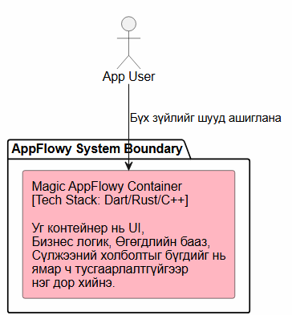

# UE-4: C4 Container Rework & Anti-Pattern Refactoring

Энэхүү баримт бичигт Bhatti et al. (Ch. 6) болон Chinchilla (Ch. 2)-ийн техникийн бичвэр, архитектурын зарчмуудын дагуу C4 Container диаграммын refactoring (засан сайжруулалт) хийсэн дасгалыг баримтжуулав.

---

## 1. Initial C4 Container Diagram (With Anti-Pattern)

Анхны загварт **"Magic Container"** буюу бүх зүйлийг нэг дор агуулсан тодорхойгүй монолит бүхий архитектурын anti-pattern-ийг оруулсан.

### Anti-Pattern-ийн дутагдалтай талууд:
* **Responsibility Blur:** Хэрэглэгчийн интерфейс (UI), бизнес логик, өгөгдлийн бааз, болон сүлжээний ижилсүүлэлт бүгд нэг контейнерт.
* **Lack of Tech Stack Clarity:** Технологийн стек нь "Dart/Rust/C++" гэж тодорхойгүй бичигдсэн.
* **No Boundaries:** Бүрэлдэхүүн хэсгүүдийн хоорондын харилцаа (FFI, SQL) баримтжуулагдаагүй.

---

## 2. Refactored C4 Container Diagram (Clean Architecture)

Chinchilla Ch. 2-т заасан систем задлал болон Bhatti Ch. 6-ийн Three-Step Rule-ийг ашиглан бие даасан 3 контейнер болгон засав.

### Сайжруулсан талууд:
1. **Flutter UI Frontend:** Зөвхөн хэрэглэгчийн интерфейсийг хариуцна.
2. **Rust Core Engine:** Бизнес логик болон Markdown боловсруулалтыг бие даан хариуцна.
3. **SQLite Database:** Өгөгдөл локалд хадгалах сан тусдаа тусгагдсан.

---

## 3. Refactoring Justification (1-Page ADR)

### Status
Accepted

### Context
Анхны "Magic Container" загвар нь AppFlowy-ийн систем хэрхэн ажилладгийг шинэ хөгжүүлэгчид болон архитекторын багт ойлгомжтой харуулж чадахгүй байв. 

### Decision
* Системийг UI (Dart/Flutter), Core Logic (Rust), болон Persistence Layer (SQLite) гэсэн бие даасан 3 контейнерт задлав.
* Контейнеруудын хоорондын харилцааг "Dart-Rust FFI" болон "SQL Queries" гэж тодорхой зааж өгөв.

### Consequences
* **Сайн тал:** Системийн бүтэц ойлгомжтой болж, модулиудыг тус тусад нь тестлэх боломжтой болсон.
* **Сөрөг тал:** FFI болон баазын харилцааг нарийвчлан зохион байгуулах шаардлагатай.

---

## 4. Concluding Reflection Questions

1. **Bhatti et al. Concept:** Ch. 6 (p. 112) дээрх "Start on paper" зарчим нь диаграммыг шууд дижитал хэрэгслээр зурахаас илүү эхлээд ноороглох нь санаагаа тодорхойлоход тусалдгийг ойлгуулав.
2. **Chinchilla Concept:** Ch. 2 (p. 22-23) дээрх архитектурыг тусгаарлах зарчмыг цаашдын бүх програмын архитектур дээр үргэлжлүүлэн ашиглана.
3. **Observed Discrepancy:** Номон дээр диаграмм бүрийг маш нарийн стандарттай зурахыг шаарддаг бол практик дээр хөгжүүлэгчид хэт товч бөгөөд тодорхойгүй байдлаар дүрслэх хандлагатай байдаг.